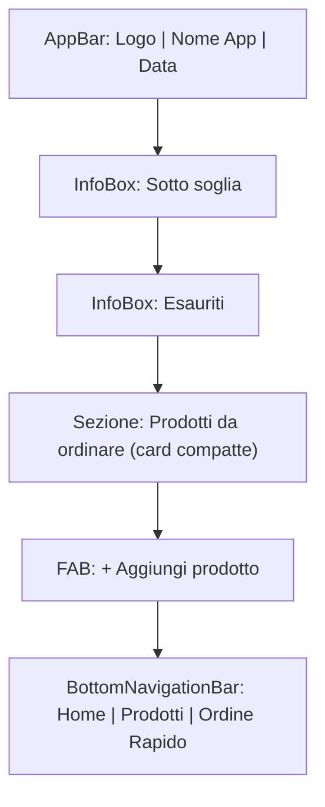
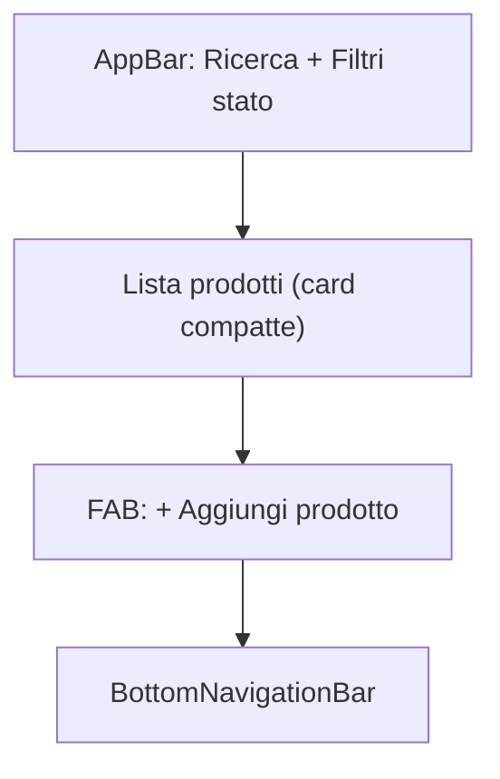
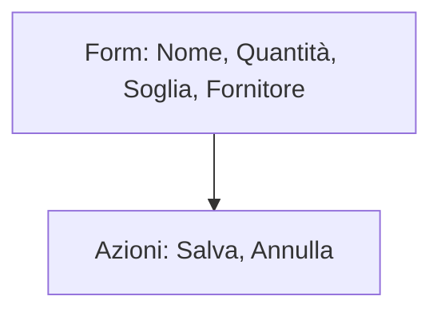
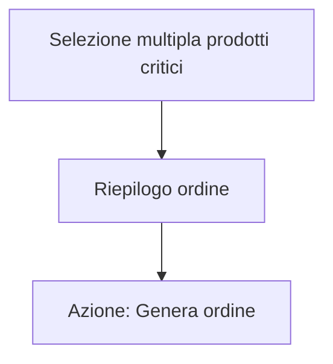

# Stockly – Design System

## 1. Wireframe Visuali (Mermaid)

### Home


### Prodotti


### Aggiungi/Modifica Prodotto


### Ordine Rapido


---

## 2. Palette Colori

| Nome        | Colore   | Codice   |
|-------------|----------|----------|
| Primario    | Teal     | #009688  |
| Secondario  | Verde    | #43A047  |
| Errore      | Rosso    | #E53935  |
| Avviso      | Giallo   | #FFB300  |
| Sfondo      | Grigio   | #F5F5F5  |
| Testo       | Nero     | #212121  |
| Testo 2     | Grigio   | #757575  |

---

## 3. Tipografia

- **Font principale:** Poppins, Roboto, Inter (sans-serif)
- **Titoli:** Grandi, bold
- **Testo:** Medio, leggibile
- **Bottoni:** Uppercase, bold

---

## 4. Componenti UI

### AppBar
- Elevata, sfondo chiaro o con sfumatura
- Logo a sinistra, nome app, data a destra

### InfoBox
- Card arrotondate, icone grandi, numeri evidenti
- Colori di stato: giallo (sotto soglia), rosso (esauriti)

### Card Prodotto
- Elevazione, icona prodotto, nome, quantità, soglia
- Azioni rapide: modifica, ordina, elimina

### FloatingActionButton (FAB)
- Tondo, colore primario, icona “+”

### BottomNavigationBar
- Sfondo bianco, icone grandi, label chiari
- Effetto pill su selezionato

### Form
- Campi arrotondati, icone nei campi
- Validazione chiara, pulsanti grandi

### SnackBar
- Feedback per azioni (aggiunta, modifica, errore)

### Dialoghi
- Arrotondati, icone e colori coerenti

---

## 5. Linee guida di stile

- **Chiarezza:** informazioni critiche subito visibili
- **Rapidità:** azioni principali sempre accessibili
- **Modernità:** look pulito, colori coerenti, icone chiare
- **Accessibilità:** testi leggibili, contrasti adeguati, touch target ampi
- **Animazioni:** transizioni fluide, feedback visivo su tap

---

## 6. Struttura file/widget Flutter consigliata

```
lib/
├── main.dart
├── theme.dart
├── screens/
│   ├── home_page.dart
│   ├── prodotti_page.dart
│   ├── ordine_rapido_page.dart
│   └── add_edit_product_page.dart
├── widgets/
│   ├── info_box.dart
│   ├── product_card.dart
│   ├── main_button.dart
│   ├── fab_add_button.dart
│   ├── search_bar.dart
│   └── bottom_nav_bar.dart
├── provider/
│   └── product_provider.dart
├── models/
│   └── product_model.dart
└── services/
    └── firebase_service.dart
```

---

## 7. Best practice UX/UI

- Usa const dove possibile per performance
- Suddividi la UI in widget piccoli e riutilizzabili
- Usa ListView.builder per liste lunghe
- Usa colori di stato coerenti per feedback immediato
- Mostra sempre le azioni principali (FAB, bottoni)
- Usa SnackBar per feedback
- Mantieni la navigazione semplice e intuitiva
- Testa la UI su diversi device e risoluzioni

---

**Questo design system è la base per un redesign moderno, business e facilmente scalabile di Stockly.**

---

## 8. TODO-list Redesign UI (Prodotti & Ordine Rapido)

- [ ] Analisi requisiti e stile da documentazione
- [ ] Refactoring ProdottiPage (prodotti_page.dart)
    - [ ] AppBar moderna con ricerca e filtri
    - [ ] Lista prodotti con card compatte e azioni rapide
    - [ ] FAB moderno per aggiunta prodotto
    - [ ] Empty state illustrato
    - [ ] Dialog aggiunta/modifica prodotto moderni
    - [ ] Layout responsive e padding adattivo
    - [ ] Uso cost e widget separati
- [ ] Refactoring OrdineRapidoPage (ordinerapido.dart)
    - [ ] AppBar moderna
    - [ ] Dropdown fornitori moderno con azioni
    - [ ] Dialog aggiunta/modifica fornitore moderno
    - [ ] Lista prodotti critici con card compatte
    - [ ] Bottone "Genera Ordine" evidente e moderno
    - [ ] Feedback SnackBar e validazione
    - [ ] Layout responsive e padding adattivo
- [ ] Creazione/aggiornamento widget riutilizzabili se necessario
- [ ] Test visivo e responsive su diverse dimensioni
- [ ] Piccole migliorie alla Home (opzionale)
